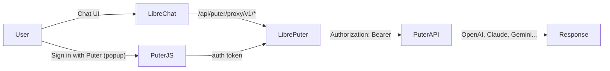

# LibrePuter

Bridge **500+ AI models** (OpenAI, Claude, Gemini, Grok, DeepSeek, and more) into any **OpenAI-compatible chat client** (like LibreChat) — **without any API keys**.

Powered by [Puter.js](https://developer.puter.com) and the **User-Pays model**: users sign in with their own Puter account and cover their own AI usage. You pay nothing for infrastructure.

## How it works



1. **Puter.js** runs in the browser — user clicks "Sign in with Puter" to authenticate
2. **LibrePuter** stores the user's Puter auth token server-side
3. **LibreChat** sends AI requests to LibrePuter, which forwards them to Puter's API with the user's token
4. **Puter** routes to the correct AI model — the user's Puter account covers the cost

## Quick Start

### 1. Install LibrePuter

```bash
cd path/to/LibrePuter
npm install
npm run build
```

### 2. Configure LibreChat

Add this to your `librechat.yaml`:

```yaml
endpoints:
  custom:
    - name: "Puter"
      baseURL: "http://localhost:3090/api/puter/proxy/v1"
      apiKey: ""
      models:
        default: []
        fetch: true
      modelDisplayLabel: "Puter AI"
      titleConvo: true
```

### 3. Start the proxy

```bash
npm run dev -w packages/librechat-backend
```

### 4. Sign in

In LibreChat, select "Puter" as your endpoint, click **"Sign in to Puter"**, and authenticate with your Puter account. All 500+ AI models become available — no API keys required.

## Modes

| Mode | Description | API Keys Needed |
|------|-------------|-------------|
| **Hosted** (default) | Proxies to `https://api.puter.com`. Users sign in with Puter account and pay their own usage. | No |
| **Self-hosted** | Proxies to your own Puter server. Useful with local Ollama models. | No (for Ollama) |

Set mode via `LIBREPUTER_MODE` env var or the setup wizard.

## Puter.js setup

LibrePuter expects Puter.js to be available on the page. Include it in your LibreChat frontend:

```html
<script src="https://js.puter.com/v2/"></script>
```

Or install the npm package:

```bash
npm install @heyputer/puter.js
```

## Architecture

```
C:\Users\weaka\LibrePuter\
├── packages/
│   ├── librechat-backend/    # Express proxy + token management
│   └── librechat-ui/         # React login components
├── config/
│   ├── librechat.yaml.example
│   └── puter.config.json.example
└── scripts/
    └── setup.js              # Interactive setup wizard
```

## Packages

| Package | Description |
|---------|-------------|
| `@libreputer/librechat-backend` | Express router with `/api/puter/*` endpoints, token store, AI request proxying |
| `@libreputer/librechat-ui` | React components: `PuterLoginButton`, `PuterLoginDialog`, `usePuterAuth` hook |

## API Endpoints

| Endpoint | Method | Description |
|----------|--------|-------------|
| `/api/puter/login` | POST | Store user's Puter auth token |
| `/api/puter/logout` | POST | Clear user's Puter session |
| `/api/puter/status` | GET | Check auth status |
| `/api/puter/models` | GET | List available models (public) |
| `/api/puter/models/details` | GET | List models with metadata (public) |
| `/api/puter/proxy/v1/*` | ALL | Proxy AI requests to Puter (auth required) |

## License

AGPL-3.0