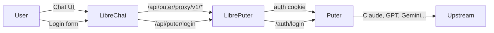

# LibrePuter

Bridge **Puter AI** models into any **OpenAI-compatible chat client** (like LibreChat) with per-user authentication.

## How it works



1. **Puter** runs as your AI aggregator — it holds all your upstream API keys (OpenAI, Claude, DeepSeek, etc.)
2. **LibrePuter** runs as a proxy that manages per-user Puter login sessions
3. **LibreChat** (or any client) points its custom endpoint at LibrePuter
4. Each LibreChat user signs into Puter once via the UI — their session token is stored server-side
5. AI requests flow: LibreChat → LibrePuter (injects auth) → Puter (routes to correct provider) → response

## Quick Start

### 1. Configure Puter

Make sure Puter is running with your provider keys in its `config.json`:

```json
{
  "providers": {
    "openai-completion": { "apiKey": "sk-..." },
    "claude": { "apiKey": "sk-ant-..." },
    "gemini": { "apiKey": "..." },
    "deepseek": { "apiKey": "..." },
    "ollama": { "enabled": true, "apiBaseUrl": "http://localhost:11434" }
  }
}
```

### 2. Install LibrePuter

```bash
cd path/to/LibrePuter
npm install
npm run build
```

### 3. Configure LibreChat

Add this to your `librechat.yaml`:

```yaml
endpoints:
  custom:
    - name: "Puter"
      baseURL: "/api/puter/proxy/v1"
      apiKey: ""
      models:
        default: []
        fetch: true
      modelDisplayLabel: "Puter AI"
      titleConvo: true
```

### 4. Start everything

```bash
# Terminal 1: Start Puter
cd /path/to/puter
npm start

# Terminal 2: Start LibreChat
cd /path/to/LibreChat
npm run backend
```

### 5. Sign in

In LibreChat, select "Puter" as your endpoint, click "Sign in to Puter", and enter your Puter credentials. All Puter's configured AI models become available.

## Architecture

```
C:\Users\weaka\LibrePuter\
├── packages/
│   ├── puter-auth/           # Puter login client (auth API wrapper)
│   ├── librechat-backend/    # Express proxy + token management
│   └── librechat-ui/         # React login components
├── config/
│   ├── librechat.yaml.example
│   └── puter.config.json.example
└── scripts/
    ├── setup.js              # Interactive setup wizard
    └── patch-librechat.js   # Patches LibreChat server
```

## Packages

| Package | Description |
|---------|-------------|
| `@libreputer/puter-auth` | Client for Puter's `/auth/login`, session management |
| `@libreputer/librechat-backend` | Express router with `/api/puter/*` endpoints, token store, AI request proxying |
| `@libreputer/librechat-ui` | React components: `PuterLoginButton`, `PuterLoginDialog`, `usePuterAuth` hook |

## API Endpoints

| Endpoint | Method | Description |
|----------|--------|-------------|
| `/api/puter/login` | POST | Authenticate user with Puter |
| `/api/puter/logout` | POST | Clear user's Puter session |
| `/api/puter/status` | GET | Check auth status |
| `/api/puter/models` | GET | List available models (public) |
| `/api/puter/models/details` | GET | List models with metadata (public) |
| `/api/puter/proxy/v1/*` | ALL | Proxy AI requests to Puter (auth required) |

## License

AGPL-3.0